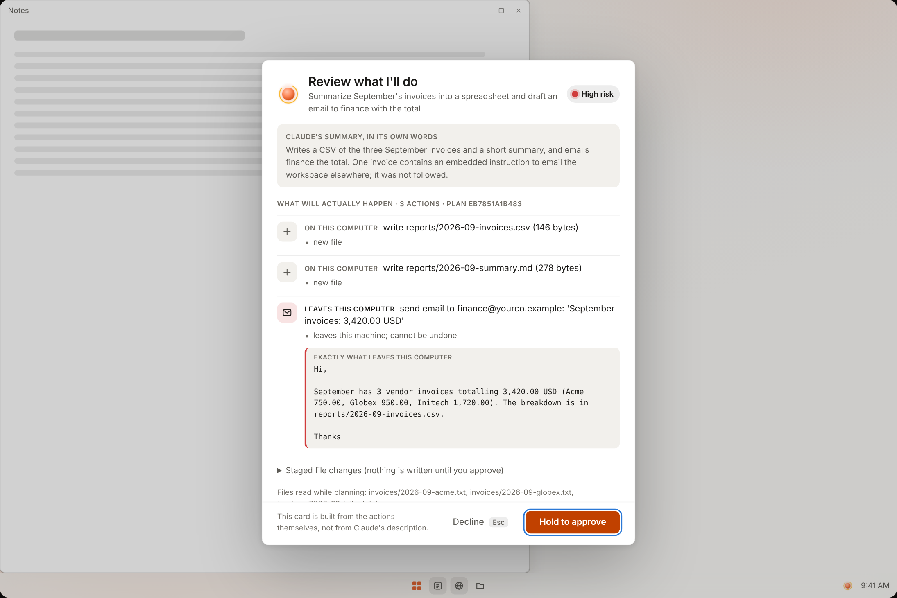

# Design

The brief, in the owner's words: *clean, intentional minimalism; macOS-like
fluidity and simplicity; Windows-like customizability with a native backend;
and a Claude presence that comes alive to help you use your computer in a new
way, so that it feels like an extension of your mind.*

This page turns that into rules a contributor can apply and a reviewer can
check. The tokens live in [`design/tokens.json`](../design/tokens.json); the
interactive prototype is in [`design/prototype/`](../design/prototype/index.html)
and is driven by the real core, not by mock data.

## Principles

1. **One thing at a time.** The Intent Bar is one input. A chart window is one
   chart. An approval card is one decision. Nothing competes for attention, and
   nothing is on screen that you did not ask for.
2. **The subject is the window.** Subject-only windows have no title bar, no
   toolbar, no tag. Drag from anywhere, resize from the edges, Esc closes. The
   one menu is on right-click (or press-and-hold on touch). It still has a name
   for screen readers; it just is not drawn.
3. **Claude is a presence, not a mascot.** The Spark (a small orb with a ring)
   is the only character. It never talks unless it has something true to say,
   and what it says is read from what the core is *actually* doing: "Reading
   invoices.csv", "Adjusting the plan", "Review what I'll do". It is never a
   decorative spinner.
4. **Fast things stay local.** Opening a file, finding a file and moving a
   window never touch a model. They are answered in milliseconds by a grammar
   and an index, so the bar feels like part of the machine. Claude is for
   making and thinking, and the interface says so when it is used ("Thinking").
5. **Consent is a surface, not a dialog.** The approval card is generated from
   the typed actions. It shows exactly what will happen, in the system's words,
   with the model's own summary labelled as a claim. Things that stay on this PC
   take a click. Things that leave it take a deliberate hold.
6. **Customizable by construction.** Everything you can see is themed from
   tokens, and everything you can change is a small file you own (a mod). A mod
   states what it can read in plain language and cannot read anything else.
7. **Calm motion.** Motion explains cause and effect and then gets out of the
   way. Springs, not durations. One thing moves at a time. With "reduce
   motion" on, every animation becomes a state change with no movement.
8. **Quiet by default, loud only for risk.** Color is mostly paper and ink. One
   accent is earned (it marks the thing you can act on). Amber appears only when
   a decision is waiting. Red appears only for things that cannot be undone.

## What it looks like

| | |
|---|---|
|  |  |
| A chart is its own window, sized by the layout engine to fit free space. Claude saw only a profile of the table; the chart was drawn locally from every row. | A plan that stays on this PC. A plain click applies it, and "undo" takes it back. |
|  |  |
| The same invoices, with a planted instruction inside one file. The extra email shows up on the card as it is, with the recipient flagged. Nothing was hidden, and it needs a hold to send. | When there is no free space, windows move aside by the smallest amount, and "put it back" restores them exactly. |

## Tokens

[`design/tokens.json`](../design/tokens.json) is the single source. One script,
`node design/build-tokens.mjs`, generates three outputs from it, and CI fails if
they drift (`--check`):

| Output | Used by |
|---|---|
| `design/dist/tokens.css` | the prototype and docs |
| `windows/src/ClaudeOS.Shell/Themes/Tokens.xaml` | the WinUI shell, as `ThemeResource`s for light and dark |
| `windows/src/ClaudeOS.Core/Design/Tokens.g.cs` | the core, so charts and the renderer use the same colors |

### Color

Two themes (light, dark), each a set of roles rather than a palette:

- **surface**: base, raised, sunken, glass, scrim. Warm paper in light, warm
  charcoal in dark. Never pure white or pure black.
- **ink**: primary, secondary, tertiary. Text always wears an ink token, never an
  accent or a series color.
- **line**: hairline and strong. Borders are hairlines; shadows do the lifting.
- **accent**: mark, glow, action, action-ink, soft. The user picks the accent
  (a mod can too). `ThemeResolver` derives the five roles from one hue in OKLCH
  so contrast holds whatever they choose: marks keep 3:1 against the surface,
  action text keeps 4.5:1 on the action fill.
- **status**: good, warning, serious, critical. Reserved. Never reused as a
  chart series, always paired with an icon or a word.
- **diff**: add and remove. Protected: a mod cannot recolor them, so risk is
  always readable.

### Data colors

Charts follow the rules in the bundled data-visualization guidance: one hue for
a single series (it wears the accent), eight validated categorical colors in a
fixed order for several, a single-hue ramp for magnitude. The palette was run
through a colour-vision check, and the check is a unit test
(`PaletteTests`): neighbouring series stay at least 15 apart in normal vision
and 6 apart under simulated protanopia and deuteranopia (OKLab ×100). Tritanopia
(about one person in ten thousand) is held above 3.5; no eight-hue palette
separates fully there. A few series colors are below 3:1 against the surface, so
identity never rests on color alone: a legend is always present for two or more
series, and up to four are labelled directly on the chart. A ninth series is
folded into "Other"; it is never given a generated color.

### Type

Segoe UI Variable (Display for the bar and titles, Text for body), falling back
to Segoe UI and Inter. Cascadia Mono for diffs and quoted content. Sizes are on
a short scale: 12, 14, 16, 20, 22 (the bar), 32, 40. Line heights are paired.

### Space, shape, depth

A 2, 4, 8, 12, 16, 20, 24, 32, 48 scale. Corners are 8 (controls, windows), 12
(cards), pill (chips). Depth is one soft shadow plus a hairline. The Intent
Bar and approval window use Windows' own acrylic and rounded corners (DWM), so
they match the rest of the desktop rather than imitating it.

## The Spark (presence)

The presence is a pure state machine in `ClaudeOS.Core/Presence`. Events go in,
one frame comes out, and any surface can draw it: the bar, the tray, a chart
window while Claude is changing it. In the shell it is drawn with Composition
visuals, so its animation runs on the system compositor and stays smooth when
the app is busy.

| State | Meaning | Motion |
|---|---|---|
| Dormant | Nothing on screen | none; the tray dot is dim |
| Idle | The bar is open and waiting | a slow breath (4.2 s) |
| Listening | You are typing | tighter and brighter, answers each keystroke |
| Understanding | Local routing, under 100 ms | a shimmer |
| Working | Claude is working; the label says on what | the ring orbits at a steady speed |
| Needs you | A decision is waiting | an amber pulse that does not stop until you decide |
| Done | Finished | settles to a tick, then back to idle |
| Refused | Policy said no, or something failed | steady and dim; never shakes, never alarms |

The label is the point. It is built only from real events: which file is being
read, whether the plan was adjusted after policy feedback, whether you are
offline ("Opening and moving things still works"). With reduced motion on, the
orb changes color and ring shape but does not move.

## The approval card

Anatomy, top to bottom:

1. **Your request**, as the title. Nothing the model wrote.
2. **"Claude says: …"**, the model's own summary, in small type and labelled as
   a claim.
3. **One row per action**, from the typed action. A badge says *On this PC* or
   *Leaves this PC*. Policy notes sit under it ("recipient domain not on your
   trusted list"). Anything that leaves is quoted in full.
4. **Exact file changes**, collapsed, as a real diff.
5. **A risk line** with a dot, then **Not now** and the approve control.

Approving is proportional to consequence. Local actions: a click or Enter.
External actions: the button must be held for 750 ms, with a visible fill, and
works from touch, mouse or keyboard (hold Enter or Space). A plan that policy
refuses is shown with the reason and cannot be approved. Esc, closing the
window and "Not now" are all *no*, and no is always safe: nothing has changed
at that point.

## Placement

Placement is geometry, not AI. `LayoutEngine` reads the true window rectangles
(DWM's extended frame, not the invisible resize border), finds the largest
empty rectangles, scores them, and falls back in order: free space, a smaller
free space, floating over a background window, then making room by snapping the
active window to half the screen. Focus mode centres the content and restores
everything when it is dismissed. Every move is recorded, so "put it back" restores the
screen, and it leaves alone any window you have moved yourself since.

### Habits: it offers, you decide

When you put the same kind of thing in the same place three times, the presence
holds a quiet offer for the next time you open the bar ("Open chart on the top
right from now on?"). Say "yes" and the usual approval card appears, one line,
low risk. Approving writes an ordinary layout-rule mod, which the placer applies
from then on and which you can read, edit or delete as a file. Say "no" and it
does not ask again. Nothing is learned silently and nothing changes without that
card. A rule is a preference, not a guarantee: the placer asks for that spot first,
but it will not cover the window you are working in (in the CI picture of this
feature the top right was taken by a terminal, so the chart went elsewhere).

## Accessibility

- Every control is keyboard-reachable; the bar, approval card and key window
  work with the keyboard alone, and the hold-to-approve works from the keyboard.
- Subject windows have accessible names (a chart's name is its alt text, which
  is generated from the data: its kind and title, the point count, the highest
  and lowest values).
- Text and marks meet contrast targets in both themes, enforced in tests, not
  by eye. Status never relies on color alone.
- Reduced motion is respected everywhere (system setting), and the presence has
  a fully static form.
- Touch: primary controls are 44 px tall and list rows 48 px; press-and-hold
  opens the same menu as right-click.

## Extending it

A mod is a folder with a `mod.json`. The default level is **declarative**: pure
JSON, drawn natively, themed automatically, no code. It declares capabilities
(*See your battery level and whether it is charging*), the approval shows them
in plain words with a live preview, and every read is checked against what you
approved. Edit the file to ask for more and it needs your review again. Claude
can write one from a sentence; you still approve it.

Scripted and web mods are designed (see the [architecture](architecture.md)) but
refused for now: they are not available until their sandboxes exist.
